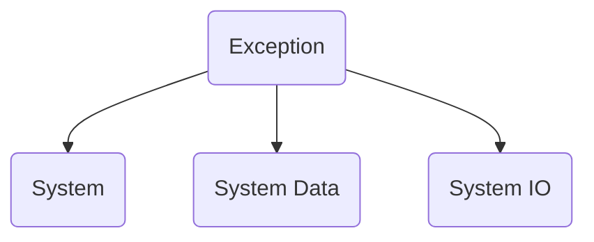

# All Exception

```mermaid
graph TD
  A(Exception) --> B(System)
  A(Exception) --> C(System Data)
  A(Exception) --> D(System IO)
  click B "all-exception/system" "System"
  click C "all-exception/system-data" "System Data"
  click D "all-exception/system-io" "System IO"
```
