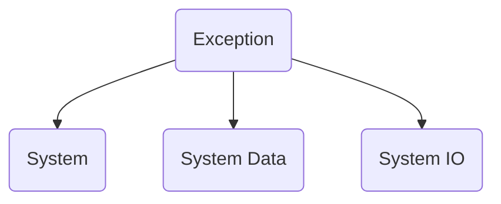

# All Exception

```mermaid
graph TD
  A(Exception) --> B(System)
  A(Exception) --> C(System Data)
  A(Exception) --> D(System IO)
  click B "System" "https://app.gitbook.com/o/jIMhRguZOp2JDax2TUF1/s/6Xoq43ZWPdsPek01tIAR/~/changes/2/all-exception/system"
  click C "System Data" "https://app.gitbook.com/o/jIMhRguZOp2JDax2TUF1/s/6Xoq43ZWPdsPek01tIAR/~/changes/2/all-exception/system-data"
  click D "System IO" "https://app.gitbook.com/o/jIMhRguZOp2JDax2TUF1/s/6Xoq43ZWPdsPek01tIAR/~/changes/2/all-exception/system-io"
```
