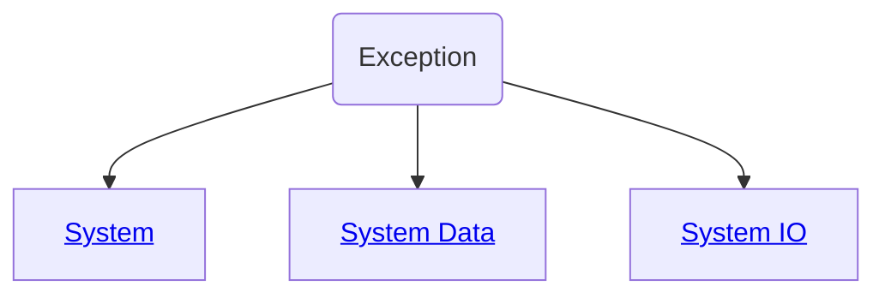

# All Exception

```mermaid
graph TD
  A(Exception) --> B[<a href='./all-exception/system.md'>System</a>]
  A(Exception) --> C[<a href='https://github.com/mikinycorporation/Handling-Error-In-CSharp/blob/main/all-exception/system-data.md'>System Data</a>]
  A(Exception) --> D[<a href='https://github.com/mikinycorporation/Handling-Error-In-CSharp/blob/main/all-exception/system-io.md'>System IO</a>]
```
