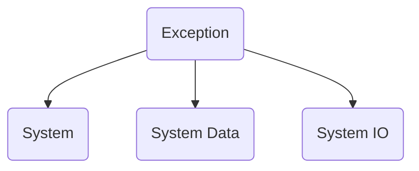

# All Exception

```mermaid
graph TD
  A(Exception) --> B(System)
  A(Exception) --> C(System Data)
  A(Exception) --> D(System IO)
  click B "https://github.com/mikinycorporation/Handling-Error-In-CSharp/blob/main/all-exception/system.md" "System"
  click C "https://github.com/mikinycorporation/Handling-Error-In-CSharp/blob/main/all-exception/system-data.md" "System Data"
  click D "https://github.com/mikinycorporation/Handling-Error-In-CSharp/blob/main/all-exception/system-io.md" "System IO"
```
